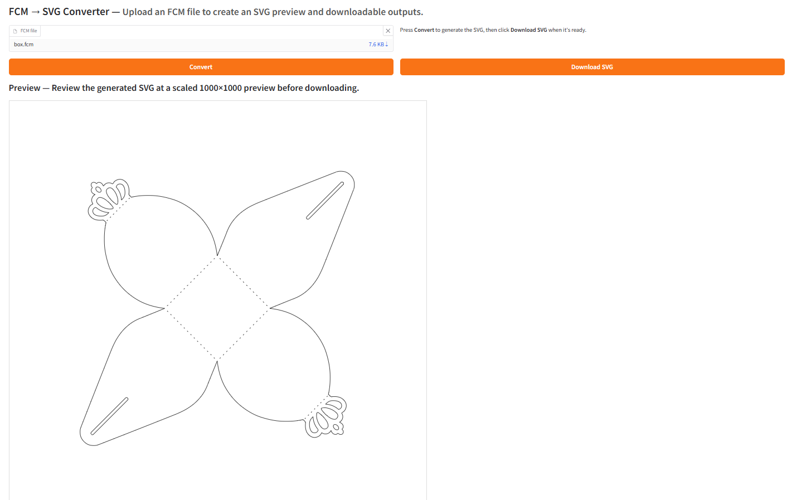

# Converter FCM 2 SVG in web-browser

This project contains my current research into writing a
free software implementation of brother's FCM format. I only created the convenient Windows installer and the Gradio web interface; the converter itself is based on the original work by [justjanne/fcm-parser](https://github.com/justjanne/fcm-parser). Thank you to the original author for the FCM-to-SVG conversion code.

## Screenshot

*Web interface built with **Gradio** — upload an FCM file, preview the generated SVG, and download the result.*



The data types used by the web app are documented in [fcm_format.txt].

## Features

- Read any FCM file 
- Convert any FCM file to SVG

## Windows quick start

1. Download the project (easiest): grab the ZIP from GitHub, unzip it anywhere, and open the extracted folder.  
   - Direct ZIP link: `https://github.com/eXProfi/fcm-parser/archive/refs/heads/main.zip`
2. If you prefer Git instead of a ZIP: `git clone https://github.com/eXProfi/fcm-parser.git`
3. Open the project folder in Windows Explorer or PowerShell.
4. Run `install.bat`. It will download and install Python 3.11.9 into the project folder (if you do not have it yet), set up a virtual environment, and install everything the converter needs.
5. Start the converter any time with `start_converter.bat`. The app will open in your default browser.

## Web interface (Gradio)

You can run a simple local web app for converting FCM files to SVG using a Python 3.11.9 virtual environment:

```bash
python -m venv venv
source venv/bin/activate
pip install -r requirements.txt
python gradio_app.py
```

On Windows you can launch the app (and open it automatically in your browser) with:

```
start_converter.bat
```

The batch script activates the `venv`, runs the app, and deactivates the environment when the process ends. The app opens in your default browser via `demo.launch(inbrowser=True)`. Upload an FCM file to see the SVG preview and download both the SVG and the embedded thumbnail (`.bmp`).

## Roadmap

- Allow writing FCM files
- Rewrite the parser and serializer in Rust

SVG to FCM:
- https://stackoverflow.com/questions/734076/how-to-best-approximate-a-geometrical-arc-with-a-bezier-curve
- https://stackoverflow.com/questions/3162645/convert-a-quadratic-bezier-to-a-cubic-one

[fcm_format.txt]: docs/fcm_format.txt
